# 🚗 Dealer’s TD
**Tower Defense de Concessionária Automotiva com Humor e Caos Controlado**


---

## Conceito

**Título Provisório:** Dealer’s TD  
**Gênero:** Tower Defense  

**Resumo:**  
O jogador gerencia uma **concessionária**, transformando **funcionários e departamentos** em torres de defesa para sobreviver a ondas de **clientes impacientes, fiscais e sabotadores** — tudo com um **pouco de humor satírico** e **estratégia corporativa**.

---

## Design

- **Humor Satírico:** Paródia da vida corporativa e do atendimento ao cliente.  
- **Estratégia Acessível, Profundidade Oculta:** Fácil de entender, mas com sinergias entre as torres.  
- **Caos Gerenciável:** O objetivo não é evitar o caos, mas controlá-lo e lucrar com ele.

---

## Gameplay Loop

O jogo alterna entre duas fases principais:

```mermaid
graph TD
    A[Fase de Gerenciamento] --> C["Pressiona 'Abrir as Portas! (Começar Wave)'"] --> B[Fase de Caos]
    B --> A

    subgraph A [Fase de Gerenciamento]
        direction LR
        A1(Planejar) --> A2(Construir) --> A3(Fazer Upgrades)
    end

    subgraph B [Fase de Caos]
        direction LR
        B1(Inimigos Avançam) --> B2(Ativar Skills)
    end
```



**Fase de Gerenciamento:** Construção e posicionamento de torres, upgrades estratégicos e planejamento financeiro.  
**Fase de Caos:** Inimigos avançam enquanto o jogador utiliza habilidades e defesas automáticas.
**Resumo:** A Base seria essa, mas como em TD existe SKIP Wave, será possivel ativar **Auto Skip** ou jogar em forma mais controlada conforme mostrado acima. 
---

## Mecânicas Principais

### 4.1 Torres (Estações de Defesa)
Cada torre é definida por um `TowerResource.tres`, permitindo balanceamento fora do código.

| Estação | Descrição | Mecânica | Evolução (Exemplo) |
|----------|------------|-----------|--------------------|
| **Oficina** | Mecânicos jogam ferramentas | Dano físico + lentidão | *Pit Stop*: dobra a velocidade de ataque |
| **Vendedores** | Conversa persuasiva | Dano psicológico + chance de converter | *Telemarketing 24h*: alcance global |
| **Lava-Rápido** | Jatos de água | Dano leve + chance de atordoar | *Espuma Química*: dano contínuo |
| **Financeiro** | Análise de crédito | Congela inimigos | *Auditoria Total*: paralisa todos por 2s |
| **Segurança** | Vigias controlam o perímetro | Dano curto + revela furtivos | *Drones*: aumenta alcance e revelação |
| **Test Drive** | Carro em circuito móvel | Dano massivo por atropelamento | *Drift Mortal*: aumenta área de dano |

---

### 4.2 Inimigos (Problemas Cotidianos)
Cada inimigo é definido por um `EnemyResource.tres`.

| Inimigo | Habilidade Especial | Fraqueza / Interação Estratégica |
|----------|--------------------|----------------------------------|
| **Cliente Impaciente** | Rápido, vem em grupos grandes | Fraco contra Vendedores |
| **Fiscal do Governo** | Imune a dano psicológico | Vulnerável à Oficina |
| **Concorrente Sabotador** | Furtivo, desativa estações | Revelado pela Segurança |
| **Carro Defeituoso** | Explode ao ser "vendido" | Precisa ser derrotado à distância |
| **Transporte de Recall** | Vida alta, reduz lucro | Ideal para combos Lava-Rápido + Oficina |

---

### 4.3 Economia e Progressão
- **Renda:** Comissões por derrotar inimigos, além de bônus de consórcios e juros do Financeiro.  
- **Despesa:** Custos de construção, manutenção e upgrades.

---

## Arquitetura Técnica

### 5.1 Organização de Resources
Arquitetura centralizada em `res://resources/` com subpastas para **towers**, **enemies**, **waves**, etc.

### 5.2 Comunicação por Sinais
Sistema **desacoplado e orientado a eventos**.  
Torres e inimigos não interagem diretamente — apenas **emitem sinais** globais.

**Sinais Globais Principais:**  
`sabotage_attempt(target)`  
`enemy_defeated`  
`wave_cleared`  
`player_money_changed`

### 5.3 Gerenciadores Globais (Autoloads)

| Nó | Script | Responsabilidade |
|----|---------|------------------|
| **SignalBus** | `signal_bus.gd` | Centraliza a emissão de sinais globais |
| **PlayerState** | `player_state.gd` | Gerencia as comissões e vidas do jogador |
| **WaveManager** | `wave_manager.gd` | Controla o ritmo e composição das ondas |
| **TowerManager** | `tower_manager.gd` | Gerencia construção e upgrades |
| **EnemyManager** | `enemy_manager.gd` | Gera e controla inimigos |
| **ChaosEngine** | `chaos_engine.gd` | Cria ondas procedurais e eventos aleatórios |
| **GameState** | `game_state.gd` | Controla estados globais do jogo |
| **ObjectPool** | `object_pool.gd` | Reutiliza projéteis e efeitos |
| **Logger** | `logger.gd` | Sistema de logs customizado |

---

## 📂 Estrutura de Pastas

```
res://
├── assets/         # Arte, som, fontes
├── resources/      # Arquivos .tres (torres, inimigos, waves)
├── scenes/         # Cenas .tscn
│   ├── towers/    
│   ├── enemies/   
│   ├── projectiles/
│   ├── ui/        
│   └── levels/    
├── scripts/        # Scripts .gd
│   ├── core/      
│   ├── systems/   
│   ├── gameplay/  
│   ├── utils/     
│   └── autoload/  
├── addons/         # Plugins externos
├── main/           # Cena principal e inicialização
└── project.godot
```

---

## Fluxo de Jogo Técnico

1. `Tower.tscn` lê dados do `TowerResource.tres`.  
2. `WaveManager` inicia uma onda → `EnemyManager` instancia `Enemy.tscn`.  
3. Torres detectam inimigos e disparam projéteis (`Projectile.tscn`).  
4. `Enemy` calcula dano e, ao morrer, emite `enemy_defeated`.  
5. `PlayerState` atualiza as comissões.  
6. `WaveManager` verifica fim da onda → emite `wave_cleared`.  
7. Retorna para a **Fase de Gestão**.

---

## 📜 Scripts Base

| Script | Função |
|---------|--------|
| `Tower.gd` | Ataca inimigos e lê dados do TowerResource |
| `Enemy.gd` | Calcula HP, efeitos e derrota |
| `WaveManager.gd` | Controla ondas e spawn |
| `SignalBus.gd` | Central de sinais globais |
| `GameState.gd` | Estados globais (pause, game over) |
| `ObjectPool.gd` | Reutilização de objetos |
| `Logger.gd` | Sistema de logs customizado |

---

## Planejamento

**Prioridade Alta**
- Sistema de colocação de torres (`tower_placement.gd`)  
- Interface completa (UI e painel de upgrades)

**Prioridade Média**
- Implementar o `ChaosEngine` com eventos aleatórios  
- Sistema de salvar/carregar progresso

**Prioridade Baixa**
- Power-ups, novos inimigos e mapas temáticos

---

## Desenvolvido com
- **Godot Engine 4.x**
- **GDScript**

---

2025 Bila Bila Games Production ®
